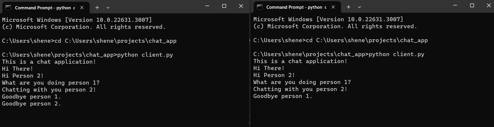

# Chat Application

A basic text-based chat application built in Python.

## Features

- Allows multiple users to connect and chat in real-time.
- Simple and easy-to-use command-line interface.

## Usage

1. Start the server by running `python server.py`.
2. Start one or more clients by running `python client.py` in separate terminal windows or tabs.
3. Enter your messages in the client terminals to chat with other users.

## Project Structure

- `client.py`: Client-side code for connecting to the chat server.
- `server.py`: Server-side code for handling client connections and message distribution.

## Dependencies

- Python 3.x
- Socket library

## License

This project is licensed under the MIT License.
